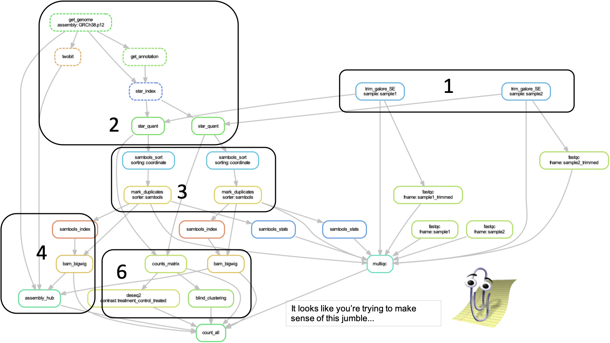
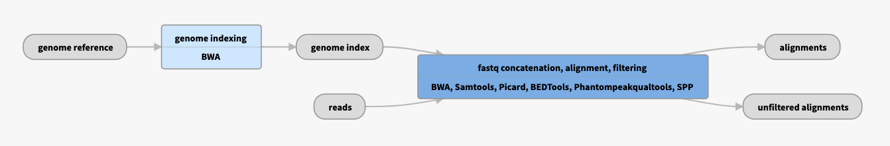
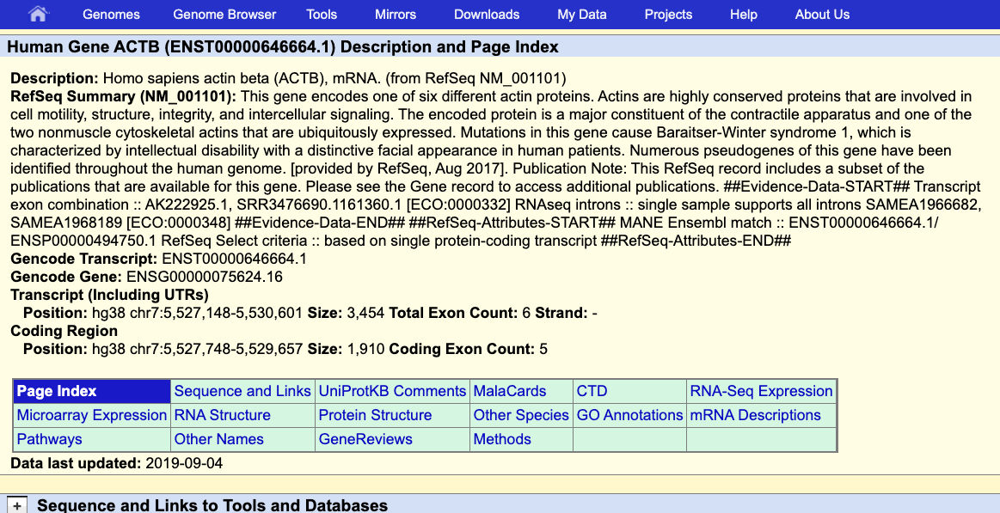
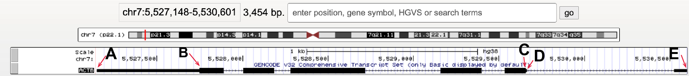

<style type="text/css">
.title {
  display: none;
}

</style>


```{r setup, include=FALSE}
#library(learnr)
knitr::opts_chunk$set(message=FALSE,warning=FALSE, cache=TRUE)
```

```{r fontcolorfunction, echo = F}
colorize <- function(x, color) {
  if (knitr::is_latex_output()) {
    sprintf("\\textcolor{%s}{%s}", color, x)
  } else if (knitr::is_html_output()) {
    sprintf("<span style='color: %s;'>%s</span>", color, 
      x)
  } else x
}

# can be used as inline code, eg: `r colorize("Additional Ideas:", "red")`  
```

## 1.1 Learning Objectives  
<br>
**This week's focus will be on how sequencing data is processed and familiarize ourselves with the UCSC Genome browser as a tool to visually inspect (epi-)genomics data.**   
<br>

> 1. Understand the steps taken to go from raw to useable data in a genomics experiment.  
2. Understand how to move in the UCSC genome browser and know how to go to regions and genes of interest.  
3. Recognize the following elements/regions in the UCSC genome browser: chromosome, centromere, telomere, gene, exon, intron, utr, promoter, and (candidate) enhancer/repressors.   
4. Tell apart UCSC genome browser tracks of H3K27ac, H3K27me3, H3K36me3, H3K4me1, H3K4me3 and H3K9me3 histone ChIP-seq and DNaseI-seq signal (and ChIP-seq input) based on their coverage profile and their location with respect to genes and other annotated genomic/chromosomal elements. 
5. Can interpret - and thus understand - ChIP- and DNaseI-seq signal in the UCSC genome browser.   
- These refer to Global learning objectives #1-3.   

<br>  

***  
<br> 

## 1.2 Genomic methods recap  

- What is ChIP-seq? What is DNaseI-seq? Presentation with ChIP-seq steps? Refer to book?  
- What is a library and what do we mean with 'library preparation'? What's the use of adapters?    
- Sequencing samples. What happens in sequencer? What is the output?  
- Illumina sequencing slides  
- Brief genomics recap/pre-quiz?  

<br>  

***  
<br>  

## 1.3 From raw data to science   
<center>  
{width=60%}  
</center>  

<br><br>  

The sequencer determines the sequence of the DNA molecules in your sample and produces massive amounts of data. In an ideal world, these data would 100% reflect reality but.. it doesn't and it is often your or a bio-informaticians task to discriminate valuable signal from artefacts and noise, that is an accumulation of reads in regions that don't actually contain binding sites of the protein of interest.   

Common origins of noise & artefacs include:  

- **Amplification Bias during the library preperation:** The amount of nucleic acids you generally obtain from your cells is often too low to be directly analyzed and one or more steps of PCR are not uncommon (unless you use special, amplification-free protocols and sequencing methods). Not all DNA or RNA molecules behave the same in this reaction. Some are amplified more than others and this generates a bias that you should control for.   
- **Synthetic DNA sequence:** These include adapters ligated to the DNA molecules to allow their amplification with uniform primers during library prep and in the sequencer. These adapter sequences come with the kit or are designed by the researcher self. Whether they are custom or commercial, they should be removed because they were not part of the original DNA or RNA material.    
- **Base call accuracy:** The chemical reaction and quality of the optical measurement that occur in the sequencer are not perfect and depend among others on the nucleotide composition of all samples, the length of the DNA molecules and the concentration of the samples. Each nt is therefore given a quality score that reflects the accuracy of the measurement or base call accuracyas it is also called.  
- Lastly, when trying to pinpoint the location in the reference genome where the DNA mo lececule most likely was derived off, we are confronted with:  
  
  * Genomic repeats. The origin of reads coming from these reigons is difficult to pinpoint. But also, the reference genome might contain more or less number of repeats than the original sample.  
  * Low complexity regions. These are regions that contain a lot of sequence similarity, eg telomeres. Because of this the quality of the reference genome is generally low in these regions.  

All these aspects need to be taken into account while processing the raw reads to usefull data.  

### 1.3.1 Post-sequencer processing steps   
The sequence of the DNA molecules outputted by the sequencer together with their quality scorese are stored in `fastq` files that show 4 lines per DNA sequence. This is an example with 2 DNA sequences (8 lines):  
<br>
</center>  
   
</center>  
<br>

Fastq files have the extension `.fq` or `.fastq`, or are compressed as `.fq.gz` or `.fastq.gz` and are always organized in the same manner. For each DNA sequence, 4 lines are printed:  
 
- line 1: start with '@'-sign and contains sequence ID given by the sequencer including sequencer id, flowcell id and sample barcode   
- line 2: the DNA sequence in ACGTN-alphabet  
- line 3: '+' (originally reported the sequence ID again)  
- line 4: quality score for each nucleotide   

<br> 

These fastq files are what the processing with.  

1. **Remove adapters and poor-quality nucleotides**: The adapters should be removed, as they were not part of the original sample and low-quality nt's are more likely to be wrong and we therefore remove those as well. This can result in the complete removal of some reads because of their overall low quality or short length.   
<br>
2. **Align reads to the genome**: Identify the likely location in the reference genome where the original DNA molecule came from. Since the first publication of the human genome, successive versions (also called *assemblies* or *builds*) have been released with improvements in quality thanks to technological advancements as well as improvements in the representativeness of the genome with respect to the genetic diversity found in the human population, including historically underrepresentated populations. We will work with the (one of the) latests relasese referred to as GRCh38 (Genome Reference Consortium Human Build 38). The alignment procedure often adds flags for reads aligned to a unique region or to multiple regions which you can use to filter.  
<br>
3. **Filter artefacts and reads aligning to multiple regions**: Remove PCR artefacts and optionally remove reads aligning non-uniquely.   
<br>
4. **Visualize the data**: .Bigwig files are created which can be uploaded to the UCSC Genome Browser which we will look at in more detail today as well.  
<br>
5. **Call peaks**: Computationally identify regions with significantly higher number of reads than expected. There are different tools out there to perform this task MACS2 is one of them and was used to call peaks in the datasets that we will be using. Peak calling is a mathemetical/statistical procedure and never black and white. It depends among others on thresholds used (p-value, false-discovery rate) abnd the control sample. And it is always wise to visually inspect the resulting peaks in the UCSC genome browser.  
<br>
6. **Read counting**: Count reads that fall within genes, other genomic elements or peak regions. These counts and the actual peak locations are used for eg. differential gene expression analyses (differentiated vs undifferentiated or control vs treatment). A well-known, widely used tool for this purpose is DESeq2.  
<br>
7. Optionally **DNaseI footprinting**, **variant calling**, **novel gene identification**: Depending on your experimental set up ... For DNaseI-seq, we can identify small depleted regions within peaks that correspond to the nucleotides that interact with the TF. This interaction protects these nucleotides from DNaseI attacks. These so-called footprints can be used to identify TF motifs and predict the likely TF bound. Although this sounds simple, and for a stable binding factor like CTCF it may be the case, it is not always that simple in reality.    
<br>

`r colorize("Additional Ideas but I do not know whether we have time for them:", "red")`    
- Mention specific softwares/tools?  
- Show examples of the files? Might help students understand how "the data" looks like. Could be in this numbered list or in section below (1.3.4).    
- Elaborate on important/often-applied settings and their rationale?  
- Add an asignment here: to put steps in the right order with quality checks in between? Like in:  
<br>
<!-- {width=70%}\    
[Sec2science / adapted from Siebrens presentation / shows RNA-seq pipeline ](https://vanheeringen-lab.github.io/seq2science/content/workflows.html)      
<br>

{width=50%}\   
[The ENCODE Project, ChIP-seq read mapping ](https://www.encodeproject.org/pipelines/ENCPL220NBH/)   
<br>  -->  

{width=70%}\   
[Furay, 2012, Nat Rev](https://pubmed.ncbi.nlm.nih.gov/23090257/)  

<br>  

***  
<br> 

### 1.3.3 Quality evaluation    
It is important to check the quality of your data along the way:   

- FASTQC (Qualty Check) software visaully summarizes the attached Phred quality scores.  
- Evaluate the data yourself in the genome browser and compare replicate samples, samples of different histone marks, compare to a reference dataset or compare to the input material.   
- Clustering of samples; can reveal label swaps, failed experiments or contaminations.   

<br>  

***  
<br>  

### <span style="color: red;">1.3.4 Output files: bigwigs, peaks & counts</span>    
`r colorize("Showing examples of how the output may look like or do this along the way in the numbered list above?", "red")`  

<br>  

***  
<br> 

### <span style="color: red;">1.3.5 Alternatively: use FAIR data   
`r colorize("Add section discussion FAIR data and referring to several platforms where it can be found? Several reserach consortia provide easy access and clear description of their data through data portals. These files can be downloaded or immediately uploaded to the UCSC Genome browser using the URL", "red")`

<br>  

***  
<br> 

### 1.3.6 Exercises   
Ideas:  

- Put steps in right order with options for quality checks.  
- Recognize a type of file?  
- Evaluate good/bad fastqc output?  

<br>  

***  
<br>  

## 1.4 Data visualization: UCSC Genome Browser     

> UCSC GB sessions for making these exercises (tip: use right-mouse click to not loose this tutorial page):  
>  
- Default should look like (if it doesn't, I need to adjust the text): http://genome-euro.ucsc.edu/s/ctoenhake/hg38_default    
- Genes and ruler only: http://genome-euro.ucsc.edu/s/ctoenhake/hg38_genesonly   
- Monocyte wiggle data (blueprint in colors, encode in black): http://genome-euro.ucsc.edu/s/ctoenhake/hg38_monos_blueprint_and_encode    
- Monocyte wiggle + peak data, blueprint only: http://genome-euro.ucsc.edu/s/ctoenhake/hg38_monos_blueprint_wiglle_and_peaks   

#### 1.4.1 UCSC Genome browser intro   
Genome browsers are great tools to display genomics data. You can walk, or *browse*, through all chromosomes, look at the location of genes, extract DNA sequences, examine pre-loaded data or upload your own data. The latter comes in quite handy when you want to, for example, have a visual (personal) confirmation of data quality, evaluate the effect of different settings for processing the raw reads, and/or confirm as computationally detected associations.  
<br>

> If you didn't do so already, watch the following youtube video's to get familiar with the UCSC Genome Browser:   
> *Tip*: use right-mouse click to not be directed away from this tutorial  
>  
1. [UCSC Genome Browser Basics](https://www.youtube.com/watch?v=DNXI-M9oQl8)  duration (mm.ss): 08.40  
2. [UCSC Genome Browser Tracks](https://www.youtube.com/watch?v=1Kpy5G_MSG8)  watch at least) from 0.00 till 3.00 *and* from 6:16 till end.  
>
> **Optionally**, finding the coordinates of a sequence using blat, handy for eg. primers, and using the Table Browser to, among others, obtain DNA, RNA or protein sequences:  
>  
3. [UCSC Genome Browser Blat, 9m39s](https://www.youtube.com/watch?v=E6DDNGDXH8A)   
4. [UCSC Genome Browser Table Browser, 7m19s](https://www.youtube.com/watch?v=Ueqt5Wgre9c&ab)  

<br>  
Important topics discussed in Video 1 include:  

- How to access your genome of intrest in the UCSC Genome Browser.
- Where you can find the chromosomal coordinates of the region currently in view or of a region you just selected (with click+drag).   
- How to move around and zoom in and out.  
- The gene structure in the UCSC Genome Browser and how you can recognize UTRs, exons, introns, and the coding direction  
- How to find the length of a region or gene.  

<br>
After watching video 2 you should be able to:  

- What we mean with a *track*.  
- Adjust how tracks are displayed, eg. *full*, *pack*, *hide* etc.  
- Display tracks from the list of tracks below the browser (important: hit `refresh`)  
  
<br>

`r colorize("Add 2-3 questions about what was discussed in video 1&2 or are question 1 till 5 sufficient?", "red")`  
<br>
Some actions and terms that were not explicitly discussed:  

- Selecting a region: hold shift + click left mouse key + drag --> select 'zoom in' option.  
- 'Upstream' and 'downstream' refer to a position relative to the coding strand of a gene. Upstream means to the 5' end and beyond. Downstream means to the 3' end and beyond. Thus, depending on the orientation of the gene upstream can mean that you move in the direction of the start of the chromosome or to the end of the chromosome.  
- ... `r colorize("more?", "red")`    

***  
<br> 
#### 1.4.1 UCSC Genome browser intro   

### 1.4.2 Go to the UCSC Genome browser  
**First, we will familiarize ourselves with browsing through the UCSC genome browser and the recognition of genes, their coding elements and their orientation.**  

<span style="color: orange; font-family: Arial; font-size:18px;">ACTION: Go to the [UCSC Genome Browser](genome.ucsc.edu).</span>   
<br> 
The starting page has been updated since the video was made but still holds the same blue bar at the top with **Genomes**, **Tools**, etc.:  
{width=100%}   

<br>

> *Tip*: In case you have been here before, it is wise to reset user settings such that you don't continue with settings from a previous project. For this, hover over "Genome Browser" and select "Reser All User Settings".  

<span style="color: orange; font-family: Arial; font-size:18px;">ACTION: To access the human genome, select the "Genomes" tab.</span>     
<br>

> *Tip*: A pop-up may appear now or one stap later, redirected you to the official European mirror site if those servers are geographically closer, that's ok.  
>  
- European mirror site, servers are located at the Universität Bielefeld Center for Biotechnology in Bielefeld, Germany: [http://genome-euro.ucsc.edu](http://genome-euro.ucsc.edu)  
- Asian mirror site, located at the RIKEN Yokohama Campus, Japan: [http://genome-asia.ucsc.edu](http://genome-asia.ucsc.edu)  

<br>
On the left you can browse and select the genome you are interested in (not a drop-down menu anymore as in the video). By default, the human genome is selected.   
<br>
<span style="color: orange; font-family: Arial; font-size:18px;">ACTION: Ensure that "Human" is selected in the **REPRESENTED SPECIES** tree (left) and "Dec. 2013 (GRCh38/hg38)" is selected under **Human Assembly** (right).</span>     
<br>
We can go to a position of our choice by entering the gene or chromosomal coordinates under **Position/Search Term** or immediatly go to the 'Current position' by clicking on `GO` on the right-hand side or **Genome Browser** in the menu bar on top.  
<br>
<span style="color: orange; font-family: Arial; font-size:18px;">ACTION: Go to *ACTB* gene (gene coding for non-muscular actin part of cytoskeleton).</span>    
<br>
Genomes page, ready to go to *ACTB* gene in Human genome GRCh38:  
  

<br>

> *Hint* your browser should be showing chr7:5,527,148-5,530,601.     

As discussed in the video, in the top of the window we have navigation and zoom bottons. Right below we can read the chromosomal coordinates and length of the regions we are currently viewing (in this case the complete *ACTB* gene). Below that we see a miniature chromosome with the characteristic gray/black pattern from karyotyping. A red `r colorize("|", "red")`-sign gives us an idea of our current positioning in the chromosome.   
<br>

> `r colorize("UCSC GB session for the following exercises (tip: use right-mouse click to not loose this tutorial page): Default should look like (if it doesn't, I need to adjust the text): http://genome-euro.ucsc.edu/s/ctoenhake/hg38_default", "red")`    

<br>
Figure for Question 1:   
{width=100%}\     
<br>
```{r Q1_actin_location, eval = F, echo=T, exercise = T}
question("Question 1: What chromosome is ACTB located on? And is it located on the short or long arm of this chromosome?",
  answer("chr7, short arm", correct = TRUE),
  answer("chr7, long arm", message = "Where do you see the red |-sign in the miniature chromosome on top?"),
  answer("chr17, short arm", message = "Review the UCSC Genome Browser Basics video, or find *chr#* in the browser window"),
  answer("chr17, long arm", message = "Review the UCSC Genome Browser Basics video, or find *chr#* in the browser window"),
  allow_retry = TRUE)
```
<br>
The data window displays various *tracks* or *track sets*. Tracks runs the complete length of the chromosome. Data includes most often:   

- **positional information**, of a gene, SNP or cir-regulatory element for example, often displayed as horizontal bars the thickness and color of which can hold additional information depending on the type of track.  
- **signal information**, of gene expression, detection of histone marks or degree of conservation. Often displayed as histograms but can also be summarized in vertical bars with different levels of color intensity encoding the signal intensity.   

<br>
`r colorize("Add a question like 'what is the name of the track with gene locations?' or a picutre with c/b/c/d/e/f etc. instead of track name and asking 'which one diplays the chromosomal coordinates and which one the gene locations?'", "red")`  
<br>
The method of display and whether individual tracks are displayed can be changed by:  

1. Right-mouse click on the grey, vertical bar at the left-most area of the Genome Browser shows you options `hide`, `dense`, `squish`, `pack` and `full`. Additional adjustments to the track can be made by selecting `Configure [track name]` in this menu.  
2. Scroll to the area below the data window, here you see a possibly overwhelming list of potential tracks, most are `hidden`. Using the pull down menu you can change display settings of multiple tracks at once. Always make sure to hit the `refresh` button below the browser window to ensure all changes are performed.  

<br>
<span style="color: orange; font-family: Arial; font-size:18px;">ACTION: hide all tracks and tracksets except for the ruler and GENCODE v32 tracks.</span>   
<br>
<span style="color: orange; font-family: Arial; font-size:18px;">ACTION: for GENCODE v32, via `Configure GENCODE v32`, make sure the option "splice variants" is unchecked.</span>     
<br>
Configuration window for GECODE v32 gene track with splice variants *unselected*:  
\    
<br>
Your GB session should look like this: {width=100%}\      
<br>
We see the complete *ACTB* gene with exons as horizontally stretched rectangles and introns as horintal lines with arrowheads in them  indicating the coding direction/strand. The exons have different heights. The highest regions correspond to  *coding* exons, the other regions are the 5- and 3UTR.  
<br>

> `r colorize("UCSC GB session for the following exercises (tip: use right-mouse click to not loose this tutorial page): Genes and ruler only: http://genome-euro.ucsc.edu/s/ctoenhake/hg38_genesonly", "red")`   

<br>
More information about *ACTB* can be obtained by clicking on the gene in the browser. Doing that brings you to a gene page like:  
{width=100%}\    
<br>
```{r Q2_ACTB_exons, eval = F, echo=T, exercise = T}
question("Question 2: How many exons does the *ACTB* gene have?",
          answer("5", message = "exons are displayed as thicker lines in the gene, introns as lines with arrows in them."),
          answer("6", correct = TRUE),
          answer("7", message = "one exon can contain coding and non-coding (UTR) elements" ),
          answer("8", message = "one exon can contain coding and non-coding (UTR) elements"),
           allow_retry = TRUE)
```
<br>  

Figure for Question 3:   


<br>     
```{r Q3_ACTB_start, eval = F, echo=T, exercise = T}
question("Question 3: Which letter points to the TSS?",
              answer("A", message = "Pay attention to how directionality is visualized in the UCSC Genome Browser, discussed in video 1 at ±4:30"),
              answer("B", message = "Pay attention to how directionality is visualized in the UCSC Genome Browser, discussed in video 1 at ±4:30"),
              answer("C", message = "Pay attention to the visualization of UTRs, discussed in video 1 at ±5:10"),
              answer("D", message = "Pay attention to the visualization of UTRs, discussed in video 1 at ±5:10"),
              answer("E", correct = T))
```
<br>
```{r Q4_ACTB_statements, eval = F, echo=T, exercise = T}
     question("Question 4: What statement about the *ACTB* gene is correct? (Select ALL that apply.) ",
              answer("ACTB gene is encoded on the minus-strand", correct = TRUE),
              answer("The TTS of ACTB gene has a higher coordinate than its TSS", message = "Look at the direction of arrows in the introns."),
              answer("The coding size of this gene is appr 2kb", correct = TRUE),
              answer("If we want to look at the promoter of this gene, we have to move slightly to the right", correct = TRUE),
              answer("The UTRs of this genes are distributed over 3 exons", correct = TRUE)
)

```
<br>

<span style="color: orange; font-family: Arial; font-size:18px;">ACTION: Go to the gene *SPI1* </span>    
<br>

*SPTI1* encodes the myeloid and B-cell–specific transcription factor PU.1 [Pham 2012 Blood](https://doi.org/10.1182/blood-2012-01-402453).  

* Copy this sentence and fill in the blanks with numbers in the code:  

`r colorize("Are up- & downstream discussed?", "red")`    
`r colorize("Klaas: no, I do not explicitly discuss up- and down-stream. Maybe explain this here very briefly. Maybe it is good practice in general to briefly explain key terms (e.g. TSS) in the practical as a reminder. This can be in the form of the ‘background’ box you also used for explaining the CD markers/monocytes.", "red")`    

SPI1 gene is located on chr [...]. It spans [...] bp and is encoded on the [plus/minus] strand. It has [...] exons and [...] introns. It is an [zinc finger domain TF/ETS-domain transcription factor]. The first downstream protein-gene is [MYBPC3/SLC39A13].

```{r Q5_spti, exercise =T, eval = F, exercise.eval=FALSE, exercise = T}
# Fill in the blanks with numbers in the code:  
SPI1 gene is located on chr ...  . It spans ... bp and is encoded on the [plus/minus] strand. It has ... coding exons and ... introns. It is an [zinc finger domain TF/ETS-domain transcription factor]. The first downstream protein-gene is [MYBPC3/SLC39A13].  
```


**Wonderfull, you are now able to recognize genes, their location within the chromosome, and their coding elements as well as their orientation. These are important reference points used when we evaluate the quality of epigenomics data and to formulate hypothesis that we can test later on.**  

<br>

***  

<br>  

### 1.4.3 Viewing BLUEPRINT data   

***Yes! Finally time for some real data! Using the UCSC Genome Browser, you will inspect characteristic histone PTM and DNaseI-seq combinations, what their location in relation to genes and - ultimately - what this may say about the gene's transcription state.***   

<br>
To upload the data we have already put them together in a so-called track hub, hosted by our own server. We can add this to our browser session by going to the tab "My Data" in the top menu and select "Track Hubs". In the "My hubs" tab you can paste a URL that directs to the data you want to upload.  
<br>

{width=100%}\    

{width=100%}\    

<br>
<span style="color: orange; font-family: Arial; font-size:18px;">ACTION: Upload the required data using the following URL [...].</span>     
<br>  
Note that, after adding the trackhub, an additional section is added below the browser, specfic to the tracks in this trackhub.  
<br>
This trackhub contains histone PTM ChIP-seq and DNaseI-seq data of monocytes, to be precise of **CD14+, CD16- classical monocytes**. 
<br>

> *Background*: CD14 and CD16 are cell surface markers of the **CD (Cluster of Differentiation) gene family** which we will come across more often during this practical. These cell surface molecules and their differential expression are used for immunophenotyping of cells. CD molecules can function as receptors, ligands and, for example, activate signalling cascades, mediate cell adhesion, cell migration, regulate gene expression etc. [HUGO, genegoups, CD](https://www.genenames.org/data/genegroup/#!/group/471)  

<br> 
We have the following datasets:  

- ChIP-seq data histone PTMs:  

    * H3K9me3 ChIP-seq (gray)   
    * H3K27me3 ChIP-seq (gray)  
    * H3K4me3 ChIP-seq (red)   
    * H3K4me1 ChIP-seq (yellow)   
    * H3K27me1 ChIP-seq (peach)  
    * H3K36me3 ChIP-seq (orange)   
    
- DNaseI-seq data in a blue track.   
- polyA-selected, stranded RNA-seq data, again in green  
- Input ChIP-seq in black.  

> *Tip*: What we haven't discussed so far is the y-axis at the left side of the track with *signal* information such as the ones just uploaded. Using this y-axis we can evaluate signal intensities. The height is currently set to 30, 50 or 100. This corresponds to the number of reads mapping to that location per million sequenced reads. You can change the height of the y-axis by right-mouse click on the trakname, select the `Configure [trackname]` option and change under "Vertical viewing range", the min" and "max". Hit `APPLY` afterwards.  

<br>
<span style="color: orange; font-family: Arial; font-size:18px;">ACTION: Go back to the *ACTB* locus and zoom out 3x to see the surrounding region.</span>     

> *Hint*: your browser should be showing chr7:5,523,694-5,534,055 approximately, a few bases more or less is not a problem.   

<br>

> `r colorize("UCSC GB session for the following exercises  (tip: use right-mouse click to not loose this tutorial page):  Monocyte wiggle data (blueprint in colors, encode in black): http://genome-euro.ucsc.edu/s/ctoenhake/hg38_monos_blueprint_and_encode", "red")`    

Use the RNA-seq data...   
```{r Q6_ACTB_expression, eval = F, echo=T, exercise = T}
question("Question 6: would you conclude that the ACTB gene is active?",
       answer("Yes", correct = TRUE),
       answer("No", message = "Look at the signal in RNA-seq data")
)
```
<br>
`r colorize("Klaas remark: would it be possible to have the students indicate why they conclude this? Perhaps by having them indicate the track on which they based their conclusion?", "red")`  
<br>

Within the Genomics tracks we can discriminate regions of high signal from the background. These are the peaks.  
<br>
```{r Q7_ACTB_DNaseIseq, eval = F, echo=T, exercise = T}
question("Question 7: Which of the following regions points to a DNaseI-seq peak?)",
  answer("chr7:5530101-5530501", message = "Nice try but this region has a H3K27ac ChIP-seq peak."),
  answer("chr7:5530501-5530800", correct = TRUE, message = "Yes. Note that this DNaseI-seq peak is located at the *ACTB* TSS/promoter"),
  answer("chr7:5532001-5532500", message = "Try again. If anything, you may be looking at the H3K4me1 signal.", ),
  answer("None of the these", message = "Try again. Please look again"),
  allow_retry = TRUE
     )
```

```{r Q8_ACTB_histone_marks_one, eval = F, echo=T, exercise = T}
question("Question 8: Which histone marks, are detected at the ACTB promoter? (Select ALL that apply)",
  answer("H3K9me3", message = "H3K9me3 is not detected here"),
  answer("H3K27me3", message = "H3K27me3 is not detected here"),
  answer("H3K4me3", correct = TRUE, message = "correct"),
  answer("H3K4me1", message = "H3K4me1 isn ot detected here"),
  answer("H3K27ac", correct = TRUE, message = "correct"),
  answer("H3K36me3", message = "H3K36me3 is detected covering the gene body, not the promoter."),
  answer("none", message = "wrong"))
```
<br>

`r colorize("Or is the promoter spanning 3kb and including the H3K4me1 peak?", "red")`  
`r colorize("Klaas remark: indeed H3K4me1 also seems to be detected at a distande of ~ 2kb from the TSS. Could be enhancer embedded in distal promoter, or could be proximal enhancer region. Maybe Simon can help distinguish this. Alternatively, we can define the promoter as a set number of bp from the TSS for this exercise", "red")`  

<br>  

***  
<br> 

### 1.4.4 Peaks from peak calling software 
***It would be cumbersume if we would have to identify all peaks manually, not to mention a highly biased procedure. Luckily we have peak calling software to help us with that. In the following section we will use those results along with the tracks.***  
<br>
The peaks have been compiled in another trackhub: [URL].  
<br>
<span style="color: orange; font-family: Arial; font-size:18px;">ACTION: Upload the peak data.</span>     
<br>
*Called* peaks are represented as horizontal bars. 
<br>

<span style="color: orange; font-family: Arial; font-size:18px;">ACTION: From *ACTB* locus, zoom out 100x.</span>     

> *Hint*: your browser should be showing chr7:5,356,175-5,701,574 approximately, a few bases more or less is not a problem.   

A prominant H3K27me3 peaks comes in the viewing window now. It covers the promoter of *FSCN1* gene. 

<span style="color: orange; font-family: Arial; font-size:18px;">ACTION: Zoom into that gene *uncluding* the prominant H3K27me3 peak.</span>     

> *Hint*: your browser should be showing chr7:5,587,501-5,611,400 approximately, a few bases more or less is not a problem.   

> `r colorize("UCSC GB session for the following exercises (tip: use right-mouse click to not loose this tutorial page): Monocyte wiggle & peak data, blueprint only: http://genome-euro.ucsc.edu/s/ctoenhake/hg38_monos_blueprint_wiglle_and_peaks", "red")`    

<br>
```{r Q9_FSCN1_bivalent_promoter, eval = F, echo=T, exercise = T}
question("Question 9: What additional histone marks, mark this region? (Select ALL that apply.)",
         answer("H3K9me3", message = "we don't see H3K9me3"),
         answer("H3K27me3", correct = T),
         answer("H3K4me3", correct = T),
         answer("H3K4me1", correct = T),
         answer("H3K27ac", message = "A very thin line, not a 'clear' peak"),
         answer("H3K36me3", message = "we don't see H3K36me3 signal."),
         answer("none", message = "We are referring to region chr7:5,373,445-5,684,304.")
         )
```
<br>
```{r Q10_FSCN1_expression, eval = F, echo=T, exercise = T}
question("Question 10: Is *FSCN1* transcribed?",
         answer("Yes"),
         answer("No", correct = T)
         )
```
<br>
This is a candidate bivalent promoter. *FSCN1* encodes a member of the fascin family (3 genes in humans) of actin-binding proteins. Fascin proteins organize filamentous actin polymers into parallel bundles. This is required for the formation of actin-based cellular protrusions during cell migration, motility, adhesion and cellular interactions of neurons, glial cells and also dendritic cells [Bros, 2003, J Immunol](https://doi.org/10.4049/jimmunol.171.4.1825). The bivalent marking of this promoter in monocytes makes sense, knowing that a proportion of monocytes differentiates into dendritic cell (also called antigen-presenting cell in this [scheme](https://ctoen.github.io/FunctGen/#Hematopoiesis_scheme)).    
<br>
The region inbetween *ACTB* and *FSCN1* is marked as well. What marks do you observe and what functional elements could they point to?  
<br>
```{r Q11_ACTB_enhacer_one, eval = F, echo=T, exercise = T}
question("Question 11: epigenetic marks inbetween *ACTB* and *FSCN1* (Select ALL that apply.)",
  answer("H3K9me3", message = "H3K9me3 is not detected here"),
  answer("H3K27me3", message = "H3K27me3 is not detected here"),
  answer("H3K4me3", correct = TRUE),
  answer("H3K4me1", correct = TRUE),
  answer("H3K27ac", correct = TRUE),
  answer("H3K36me3", message = "H3K36me3 is detected covering the gene body, not the promoter."),
  answer("DNaseI-seq", correct = TRUE))
```
<br>
```{r Q12_ACTB_enhancer_two, eval = F, echo=T, exercise = T}
question("Question 12: What functional element do these marks most likely reflect?",
  answer("terminator"),
  answer("promoter"),
  answer("TSS"),
  answer("enhancer", correct = TRUE, message = "At least the region spanning chr7:5560200-5564149 is reported a super-enhancer and controls among others the *ACTB* gene."),
  answer("centromere"),
  answer("telomere"),
  answer("coding region")
)
```
<br>
Another highly expressed gene in this cell type is *CD14*, remember it's protein was used to select these cells on. Answer the following question about this gene using the UCSC Genome Browser:   
<br>
```{r Q13_cd14_questions, eval = F, echo=T, exercise = T}
question("Question 13: What statement about *CD14* is correct? (Select ALL that apply) ",
  answer("CD14 gene is encoded on the minus-strand", correct = TRUE),
  answer("The TTS of CD14 gene has a higher coordinate than its TSS"), 
  asnwer("*CD14* is encoded on the long arm of chr5", correct = TRUE)
  asnwer("*CD14* is encoded on the short arm of chr5"),
  answer("The TSS of *CD14* is not accessible for DNaseI"), 
  answer("A DNaseI-peak appr 1.5 kb upstream of the TSS marks a candidate enhancer.", correct = TRUE),
  allow_retry = TRUE)
```
<br> 
Approximately 20 kb downstream of *CD14* is another enhancer. What histone marks populate/mark this enhancer? (Downstream with respect to the *CD14* orientation.)   

> For testing purposes: the enhancer I'm pointing to is located at chr5:140611060-140612601  

```{r Q14_cd14_enhancer, eval = F, echo=T, exercise = T}
question("Question 14: Which marks mark the enhancer 20kb downstream of *CD14*?",
  answer("H3K9me3", message = "not H3K9me3"),
  answer("H3K27me3", message = "not H3K27me3"),
  answer("H3K4me3", message = "not H3K4me3"),
  answer("H3K4me1", correct = T),
  answer("H3K27ac", correct = T),
  answer("H3K36me3", message = "not H3K36me3"),
  answer("DNaseI", correct = T),
  allow_retry = T)
```
<br>
So far we have seen active promoters, bivalent promoters and enhancers. A region silenced by H3K9me3 is loacted appr. 120kb upstream of **CD14**.  
<br>

> Tip: zoom out to chr5:140,147,501-141,605,000.  

```{r Q15_cd14_near_silencing, eval = F, echo=T, exercise = T}
question("Question 15: The expression of what gene family is controlled by this marking?",
  answer("PCDHA gene family", correct = T, message = "PCDHA gene cluster encodes a family of cadherin-like cell surface proteins that are expressed in neurons and are present at synaptic junctions."),
answer("A group of LINC RNAs"),
  answer("Family of KRAB-ZNF encoding genes", message = "not H3K27me3"),
  allow_retry = T)
```
<br>
```{r Q16_cd14_near_silencing_two, eval = F, echo=T, exercise = T}
question("Question 16: What is the approximate size of the H3K9me3 silenced region? (*Tip2: hold shift and click-and-drag in the brwoser to capture and thereby measure the width of the H3K9me3 domain)",
  answer("250kb"),
  answer("500kb"),
  answer("750kb", correct = TRUE),
  answer("1Mb"),
  allow_retry = T)
```
<br>
Silencing does not necessarily have to be mediated by H3K9me3.  
<br>
<span style="color: orange; font-family: Arial; font-size:18px;">ACTION: Go to the ACTA1 gene, encoding muscular actin. Zoom out 10x.</span>  

> *Hint*: you should be at ±  chr1:229,418,420-229,446,919.  

<br>
```{r Q17_ACTA1_marking_one, eval = F, echo=T, exercise = T}
question("Question 17: Which histone mark most likely mediates repression of *ACTA1* in these cells?",
         answer("H3K9me3", message = "H3K9me3 is not the most likely repressing mark here"),
         answer("H3K27me3", correct = T),
         answer("H3K4me3",  message = "H3K4me3 is not associated with repression."),
         answer("H3K4me1", message = "H3K4me1 is generally not associated with repression."),
         answer("H3K27ac", message = "H3K27as is not associated with repression."),
         answer("H3K36me3", message = "H3K36me3 is not associated with repression."),
         answer("none", message = "wrong"),
         allow_retry = TRUE
         )
```
<br>
H3K27me3 is not exclusive for silencers (Huang, 2019, Gen Res)[https://genome.cshlp.org/content/29/4/657]   

<br>
```{r Q18_ACTA1_marking_two, eval = F, echo=T, exercise = T}
question("Question 18: Which other observations support that this gene is not active? (Select ALL that apply)",
         answer("Absence of H3K36me3 marking covering the gene body.", message = "H3K36me3 is indeed lacking but other observations are correct as well."),
         answer("Absence of signal in RNA-seq signal", message = "RNA-seq is indeed lacking but other observations are correct as well."),
         answer("Absence of H3K4me3 signal at the *ACTA1* promoter",  message = "correct"),
         answer("All the above", correct = TRUE, message = "Indeed, the absence of signals in RNA-seq, H3K36me3 *and* H3K4me3 all support that this gene is not expressed. Observe that the H3K27me3 signal covers a relatively broad domain." ),
         allow_retry = TRUE
         )
```
<br>  

***  
<br> 

### 1.4.5 Recognizing blinded genomics data  
So far you have browsed through ChIP-, DNaseI- and RNA-seq data. These tracks had the correct track names attached to them.   
<br>
Our collegue performed ChIPs for H3K9me3, H3K27me3, H3K4me3, H3K36me3, H3K4me1 and H3K27ac on CD4+ T cells but accidentally let the tubes fall before the tubes were properly labelled (always label your tubes first and *before* adding your sample!). 
<br>
We know which ChIPs were performed, but which track (labelled a-f) is most likely which ChIP?  
<br>
<span style="color: orange; font-family: Arial; font-size:18px;">ACTION: upload the following track hub [URL].</span>   
<br>  
Which column from the following table reflects the most likely decoding?     

ChIP | encoding 1 |  encoding 2 |  encoding 3 | encoding 4   
:------:|:------:|:------:|:------:|:------:    
H3K9me3 |  a | f | d | b  
H3K27me3 | b  | a | e | c  
H3K4me3 | c | b | f | d  
H3K4me1 | d | c | a | e  
H3K27ac | e | d |  b | f  
H3K36me3 | f | e | c | a  


> `r colorize("UCSC GB session: didn't make this one yet!", "red")`    

```{r Q19_recognizing_patterns, eval = F, echo=T, exercise = T}
question("Question 19: What is the most likely encoding?",
  answer("encoding 1"),
  answer("encoding 2"),
  answer("encoding 3"),
  answer("encoding 4"),
  allow_retry = TRUE
)
```
<br>  

***  
<br> 

### 1.4.6 Summary  
To summarize, we have seen various marks, finish the following statements based on your observations in the UCSC genome browser:  

`r colorize("I prefer these be formulated as hypotheses with no correct answer but instead 'save' the answers to a file uploaded in week 2 so that students can re-evalue their answers. Perhaps ask the questions again in week 2 but that time answer them using the calculations of the whole genome/chr21", "red")`   


```{r Q20_summary, eval = F, echo=T, exercise = T}
question("Question 20: Active promoters are recognized by markings ...",
  answer("..."),
  answer("..."),
  answer("..."),
  answer("..."),
  allow_retry = TRUE
)
```
<br>
```{r Q21_summary, eval = F, echo=T, exercise = T}
question("Question 21: The marks found at bivalent promoters are ...",
  answer("..."),
  answer("..."),
  answer("..."),
  answer("..."),
  allow_retry = TRUE
)
```
<br>
```{r Q22_summary, eval = F, echo=T, exercise = T}
question("Question 22: Active enhancers are marked by ...",
  answer("..."),
  answer("..."),
  answer("..."),
  answer("..."),
  allow_retry = TRUE
)
```
<br>
```{r Q23_summary, eval = F, echo=T, exercise = T}
question("Question 23: H3K9me3-mediated silencing often spans ...",
  answer("small domain, single genes"),
  answer("broad domain, multple genes"),
  allow_retry = TRUE
)
```

<br>  

***  
<br> 

## Old text, ignore please!!  

```{r Q9_ACTB_histone_marks_two, eval = F, echo=T, exercise = T}
question("Question 9: The DNaseI-seq peak located *upstream* of the *ACTB* could be an enhancer. What observation gives additional supports for this statement?",
  answer("enhancer RNA-seq signal", message = "There is no RNA-seq signal in this region so no."),
  answer("Absence of H3K4me1 signal in this region.", message = "It is not the *absence* of H3K4me1 which is associated with enhancers... "),
  answer("Presence of H3K4me1 signal in this region.", correct = TRUE ),
  answer("The location of this DNaseI-seq peak suggests it is as it lies outside a gene", message = "Enhancer do not exclusively lie outside genes but also in for example introns."),
  allow_retry = TRUE)
```

```{r Q9_tough_one_peak_calling, eval = F, echo=T, exercise = T}
question("Question 9: What determines the width of the *called* peaks? (Select ALL that apply.)",
         answer("the False Discovery Rate used with peak calling", correct =T ),
         answer("The local read density"),
         answer("The signal in the corresponding 'input' dataset at these regions"),
         answer("The surrounding 'noise' signal"),
         allow_retry =TRUE)
```
Other H3K37me3 marked promoters:  

- MYOD1 gene, encoding tF for muscle cell differentiation   
- SLCA4A6 gene, encoding a serotonin (neurotransmitter) ... bivalent? Has bit of H3K4me1.  
- OCE2 (eye color) - also bivalent?  
- NEUROG2 (tf for noerogenesis) - also bivalent?   
- OLIG2 (tf neuro/oligodendrite genesis) - also bivalent?  

Also look at a broad H3K9me3 domain? I see some but those have H3K4me3 and H3K36me3 marking as well.... 

- Background:  

    * H3K9me3 spans braod domains of 10ks of bp's. Constitutive hetrochromatin and less often facultative heterochromatin.  
    * H3K9me3 and H3K27me3 are mechanistically differen.  
    * Not part of bivalent promoters?  
    * reviews: [Becker 2017 Trens in Genetics](https://www.ncbi.nlm.nih.gov/pmc/articles/PMC4698194/); [Ninova 2019 Genomics](https://www.ncbi.nlm.nih.gov/pmc/articles/PMC6803365/)   

- Example locations:  

    * chr19 broad domains with KRAB-ZNF encoding genes. Spanning 0.4-1Mb chr19:28,115,617-58,617,616 [Vogel 2005 Genome Res](https://www.ncbi.nlm.nih.gov/pmc/articles/PMC1665633/)  
    * 
H3K9me3 is associated with non-coding regions in the genome as well as repressing lineage-inappropriate genes [Becker 2015 Trends in Genetics](https://www.ncbi.nlm.nih.gov/pmc/articles/PMC4698194/)  


