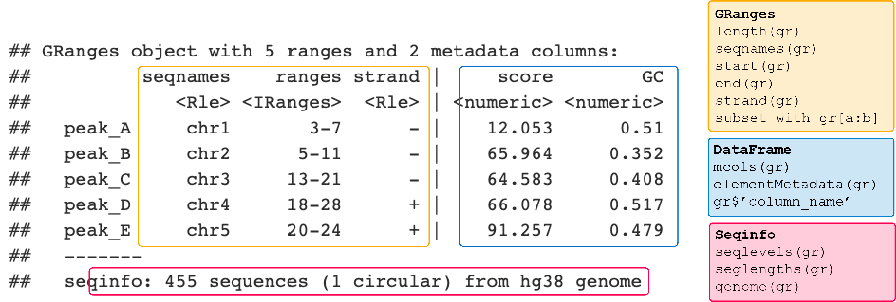
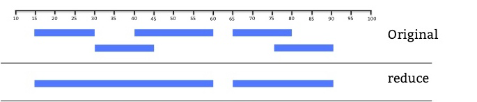

<style type="text/css">
.title {
  display: none;
}

</style>

```{r setup, echo = F, warning = F, include=FALSE}
knitr::opts_chunk$set(message=FALSE,warning=FALSE, cache=FALSE)
#installed required libraries via .yaml file environment_v3_withversions.yml
#see Home/GitHub/learnr_20201020_installing_learnr_conda_environment.txt
library(IRanges)
library(tidyverse)
library(GenomicRanges)
library(plyranges)
library(rtracklayer)
library(VennDiagram)
#library(UpSetR)
library(GenomicFeatures)
#library(ChIPseeker)
#library(ChIPpeakAnno)
#library(genomation)
source("functions.r")
```

```{r prep-txdblist, include = F}
# this is a preperatory chunk add 'exercise.setup = "prep-txdblist"` to chunk header to make object available
# This GRangesList object is used to calculate overlap of peaks with transcript-centered genomic elements (exons, introns, promoters, utrs etc.)  
txdb_annotation <- readRDS("data/prepared_rds/txdb_annotation_chr19_grangeslist.rds")
```

```{r prep-txdbindiv, echo =F}
# this is a preperatory chunk add 'exercise.setup = "prep-txdbindiv"` to chunk header to make object available
# This .RData file imports GRanges objects with genomic locations of genes, transcripts, TSSs and promoters.
# Promoters come in two flavors:  
# 1. promoters_def = default settings from promoters() function with 2kb up and 0.2 kb downstream the TSS
# 2. promoters_chr19_3k = for heatmaps, with 3kb upstream and 3kb downstream the TSS
load("data/prepared_rds/txdb_annotation_chr19_genes_tx_pr_tss_granges.RData")
```

```{r prep-encode, echo =F}
# this is a preperatory chunk add 'exercise.setup = "prep-encode"` to chunk header to make object available
# This GRanges object in this .rds file contains locations of CTCF sites, distant enhancers, promoter-promimal enhancers, promoters and DNase-h3k4me3 sites
# File was downloaded from 2020 paper: doi.org/10.1038/s41586-020-2493-4
# Labels come from ENCODE cCRE file downloaded from the UCSC Table Brower
# names in ucsc file were matched with cCRE_accession in nature paper file to get the  ucsc label attached to the right interval in the nature paper file
# annotation was added by matching 
encode_ccres <- readRDS("data/prepared_rds/encode_ccres_chr19.rds")
encode_ccres_list <- split(encode_ccres, encode_ccres$ucsc_label)
```

```{r prep-mappings, echo = F}
# this is a preperatory chunk add 'exercise.setup = "prep-mappings"` to chunk header to make object available
entrezid_symbols <- readRDS("data/prepared_rds/gene_entrezids_genesymbols_df.rds")
```

```{r prep-monodata, echo = F}
# this is a preperatory chunk, add  exercise.setup = "prep-monodata" to chunks that require this data to be evailable
load("data/prepared_rds/blueprint_monocyte_chr19_granges.RData")
```


*focus: genomic ranges, overlap functions, nearest functions.*  

## 2.1 Introduction   
<br>
In week 1 we discussed the major steps imvolved in obtaining genomics data, from experiment to raw data to normalized signal and peaks. We examined histone PTM ChIP-, DNaseI-, and RNA-seq data of monocytes in the UCSC genome browser and searched for regions with increased signal, *peaks*. We looked at the position of these peaks in the chromosome and with respect to genes as well as the co-occurence of different marks.   
<br>
These observations showed you that some marks are associated with particular functional elements, as was also discussed in class (eg active enhancer, active promoter, silenced domains).   
<br>
**This week and next week we will put numbers to these observations and perform computational analyses to answer common questions including:** "*How many peaks do I have?*", "*Is this mark statistically enriched in a particular genomic element?*", "*Which and how often do marks co-occur?*","*The expression of which gene could be affected by this mark?*",  and "*What is the signal of the mark around a particular element of interest like the TSS?*"   
<br>

### 2.1.1 Learning Objectives  

> At the end of week 2 you are able to:  
> 
> 1. Create `GRanges` and `GRangesList` objects.  
2. Import ChIP-seq peaks into a `GRanges` object in r.  
3. Apply common `base` and `plyranges` functions to summarize `GRanges` objects.   
4. Detect and count overlap between two `GRanges` objects using the `findOverlaps()` function from the `GenomicRanges` package.    
5. Visualize the number of overlaps in a vennDiagram using the `VennDiagram` package.  
6. Visualize the number of overlaps with bar- and pieplots.   
7. Statistically test for enrichment of histone marks in a particular genomic region. 
8. Identify the nearest TSS to a histone ChIP-seq peak using the `distanceToNearest()` function from the `GenomicRanges` package.  
9. Identify the genes that are associated with these TSSs.  
These refer to global learning objectives #4-#7.  

<br>

***  
<br> 

> TEASER... let's look at some of the plots you will make.    

<br>  

***  
<br> 

## 2.2 Introducing GenomicRanges        
### 2.2.1 Background Bioconductor  
[Bioconductor](https://www.bioconductor.org/) is a special repository of packages for the analysis of high throughput genomic data in r. Packages are often heavily dependend on each other and regular releases and a special installer ensure that you install package version that can work together. Usually you would use the `biocManager::install()` command to install these packages. But in this tutorial, all required packages are already installed.  
<br>
Bioconductor packages that we will be using include:   

Package | Purpose   
--|--    
[GenomicRanges](https://bioconductor.org/packages/release/bioc/vignettes/GenomicRanges/inst/doc/GenomicRangesIntroduction.html) | Provides the `GRanges` data structures to store and handle genomic intervals.  
[plyranges](https://bioconductor.org/packages/release/bioc/html/plyranges.html) | `dplyr`-like interface for interacting and manipulating `Ranges` data structures.    
[GenomicFeatures](https://www.bioconductor.org/packages/release/bioc/html/GenomicFeatures.html) | Functions to retrieve and manage genomic features from database packages.  
[rtracklayer](https://www.bioconductor.org/packages/release/bioc/html/rtracklayer.html) | Provides functions to import and work with annotation files with various formats (GFF, BED, bedGraph, BED15, WIG, BigWig and 2bit).   
`TxDb` packages | Provide an R representation of gene models, each genome has a separate package.   
`OrgDb` packages | Contain mappings between a unique gene identifier and other kinds of identifiers for a certain genome (eg from Entrez gene identifier to Gene Symbol)  
<br>
Bioconductor packages can use **data structures** different from `vectors`,`matrices` or `data.frames`. The `GRanges` data structure provided by the `GenomicRanges` package is an example and is used by many. We will come to those shortly.   
<br>
These "Bioconductor-specific-objects", like `GRanges`, generally have their own set of functions or methods that you can explore using `methods(class = "...")`. To find out the `class`, use `class(object_name)`.  
<br>
Here's a list of basic functions to explore objects and/or call the help on packages or functions:   

- Use `class()` to found out what kind of data structure you are dealing with  
- Use `show()` or `print()` to have r print a summary of your data    
- use `methods(class = "...")` to get a list of (default) methods or functions you can use to extract and manipulate the data, also called *assessor* functions or *getter* and *setter* functions       
- use `help(package = "[packageName]")` to display the help page     

<br>  

***  
<br> 

### 2.2.2 GenomicRanges: Constructing GRanges objects    
You are already familiar with the **data structures** `vector`, `matrix`, `data.frame` and `lists` in R. In genomics we often work with **interval** data. Think of peaks, genes, exons, ... any genomic region reported with tge genomic coordinates :`chr`, `start`, and `end`.   
<br>
Storing these in a `data.frame` is possible but not very efficient. E.g. a simple manipulation such as shifting all reported intervals 2 bp to the right, requires you to manipulate 2 columns at the same time.  
<br>
Interval data can be more efficiently handled with the `IRanges` package which works with a data structure especially developed for **ranges of integers**: `IRanges` objects.  
<br>
To construct an `IRanges` object we require at least two of the following three values: a starting coordinate, a finishing coordinate or the width of the interval.  
<br>
Here we create `IRranges` object `ir` with three intervals, starting at positions `3`, `5` and `17`, and ending at positions `10`, `20` and `30`:   
```{r IRanges example, echo = T}
ir <- IRanges(start=c(3,5,17), end=c(10,20,30))
print(ir)
```
Depicting `ir` visually we see blocks representing the intervals along the horizontal axis:  
```{r IRanges plot, fig.width=5, fig.height=4, echo = F }
plotRanges(ir)
```
<br>
The `GRanges` objects of the `GenomicRanges` package are very similar but require a additional `sequence name` (in other words a chromosome) for every interval. 
<br>
Here we reate a `GRanges` object using `ir` and call for it's `class` and summary (as this prints 6 lines by default, the whole object is printed in this case):    
<br>
```{r GRanges example, echo = T}
# create gr object: 
gr <- GRanges(seqnames = c("chr1", "chr1", "chr2"), ranges=ir)

# find out the class:  
class(gr)

# print a summary:
print(gr)
```
<br>
The `strand` column holds `*`, meaning the intervals are *unstranded*.  
<br>
Here we create `gr` again but define the strand for every interval with `strand =`  
```{r GRanges example2, echo = T}
# create gr object with strandinfo: 
gr <- GRanges(seqnames = c("chr1", "chr1", "chr2"), 
              ranges=ir, 
              strand = c("+", "-", "-"))
gr
```
<br>
We can add scores and names to these intervals with `score(object_name) <-` and `names(object_name) <-`. The names will replace the row idnentifiers. Additional custom columns can be defined with the `$`-sign.  
<br>
Here we add names, scores and a gc% to each interval:  
```{r GRanges example3, echo = T}
set.seed(1234) # set.seed to ensure that with the random number generation, we each time generate the same sequence of numbers
# add names to `my_gr`
names(gr) <- paste("peak", LETTERS[1:3], sep = "_")
# add a custom score
score(gr) <- round(runif(3, 0, 106), digits = 3)
# add custom GC content
gr$gc <- round(runif(3, 0.35, 0.60), digits = 3)
# print the result
print(gr)
```
<br>
`GRanges` objects follow the **tidy data principle**: each row of a `Ranges` object corresponds to an interval, and each column will represent a variable about that interval, and generally each object will represent a single unit of an observation (like gene annotations). 
<br>
Notice that the names replace the rowIDs and that this object now holds 2 **metadata columns** besides the genomic coordinates. Metadata is **data about the data**:  
<br>

Genomic coordinates |  Metadata columns   
-- | --  
Printed on the left-hand side of the `|` | Printed on the right-hand side of the `|`   
Extract using `granges(object_name)` |  Extract as DataFrame with `mcols(object_name)` or `object_name$column_name` for a specific column   
Columns are restricted to `seqnames`, `ranges` and `strand` | Almost anything can be stored in the metadata, we defined `score` and `GC`-content here  

<br>
Information about the genome and sequences is stored in `seqinfo`. This currently tells us that the intervals are from 2 sequences of a unknown genome. Genome information can be appended using `seqinfo(my_gr) <- Seqinfo(genome="hg38")`. This automatically loads the sequence information specified by `genome` by querying the UCSC database. We skip this step to limit the size of the object.     
<br>

> **Exercise 1 - Finish the following code, creating `my_gr2` with:**     
>
- Invervals A-E located on resp. chr1, chr2, chr3, chr4 and chr5  (one interval per chromosome);   
- from A to E, starts are respectively at position `3`, `5`, `13`, `18`, and `20`;   
- and a `width` of `5`, `7`, `6`, `9` and `11` bp;  
- the intervals A, B and C on the minus strand, D and E on the plus strand;  
- random scores in a variable `score`;    
- and a random GC% in the `GC`-column.   
- Then add names to each row with `names()`  
Finish by printing the summary of `my_gr` using the `print()` function.  

```{r q1_granges, exercise = TRUE, eval = F}
set.seed(1234) # set.seed to ensure that with the random number generation, we each time generate the same sequence of numbers.  

# create GRanges object 'my_gr' intervals A-C: 
my_gr <- ....(.. = c("..."), 
              .... = IRanges(start = c(..), ... = c(5, 7, 9, 11)),
              .. = c("-", "-", ..)
              .. = round(runif(5, 0, 106), digits = 3),
              gc = round(runif(5, 0.35, 0.60), digits = 3) 
              )

# add names to `my_gr`
..(my_gr) <- paste("peak", LETTERS[1:5], sep = "_")

# print summary of my_gr
..(my_gr)
```

```{r q1_granges-solution}
set.seed(1234) # set.seed to ensure that with the random number generation, we each time generate the same sequence of numbers.  

# create GRanges object 'my_gr' intervals A-C: 
my_gr <- GRanges(seqnames = c("chr1", "chr2", "chr3", "chr4", "chr5"), 
              ranges = IRanges(start=c(3, 5, 13, 18, 20), width = c(5, 7, 9, 11)),
              strand = c("-", "-", "-","+", "+"),
              score = round(runif(5, 0, 106), digits = 3),
              gc = round(runif(5, 0.35, 0.60), digits = 3) 
              )

# add names to `my_gr`
names(my_gr) <- paste("peak", LETTERS[1:5], sep = "_")

# print summary of my_gr
print(my_gr)
```
```{r q1_granges-code-check, eval = F}
grade_code()
```

### 2.3.2 Working with `GRanges`     
**Accessor functions** extract components from the `GRanges` object.  

- `start()`, `end()`, `width()`, `ranges()` and `strand()` accessors extract the respective elements from the genomic coordinates.   
- `score()` prints the scores stored in metadata.
- `names()` prints the rownames.  
- Custom metadata columns can be accessed using the `$`- sign.  

<br>
Here's a visual summary of a `GRanges` object called `my_gr` with the accessors to extract its content:     



<br>
Additional common functions to summarize and view `GRanges` objects include:  

- `length()` prints the number of stored intervals.
- `head(object_name, n = ...)` and `tail(object_name, n = ...)` print `n` number of intervals in the head or tail of the object. Can be usefull for checking that the dataset is complete.    
- GRanges behave like vectors of ranges and can be subsetted using `[subset range, metadata columns]`. E.g. `my_gr[3:5, "GC"]` will print only rows 3 to 5 and of the metadata only the `GC`-column.  

<br>
**dplyr-related functions** are available for `GRanges` through the `plyranges` package. (The `dplyr` package it self is not compatable with `GRanges`.) As the function names of `dplyr` and `plyranges` overlap, we sometimes use the formulation `package::function` to clarify to you the package we are using.   
<br>
A brief reminder of common `dplyr` functions and examples of `plyranges`-relatives on `GRanges` objects:  

Function | Purpose | Example on `GRanges`   
-- | -- | --    
`select()` | subset variables (=columns) |  `select(my_gr, GC)`
`group_by()` | group data into rows with the same value for the specified variable. |  `my_gr %>% group_by(strand)`.  
`filter()` | subset observations (= rows) | `filter(my_gr, GC < 0.4)` or `my_gr %>% group_by(strand) %>%  filter(GC == max(GC))`.     
`summarize()` | Summarise variables, often per group | `group_by(my_gr, strand) %>% summarize(n = n(), gc = max(GC))`   

<br>
We can also use the `pipe` operator `%>%` to combine functions in a workflow.  
<br>
**We will practice using these functions on real peak data, which we will import in the next section**.  
<br>

***  
<br> 

## 2.3 Peak files in R   
### 2.3.1 Data import  
Most genomic interval data comes in a tabular format that has the basic information about the location of the interval and some other information. Common file formats include BED, GFF or BigWig files. These can be imported with the base `object_name <- read.table("location/of/file.bed")` function and converted to a `GRanges` object using `gr_object <- as(object_name, "GRanges")`.  
<br>
A quicker method is to use the `import()` function from the `rtracklayer` package. This function parses the files directly into `GRanges` objects with genomic ranges and metadata.    
<br>
You will import BED files with the genomic locations of the peaks from the histone ChIP-seq experiment in monocytes we looked at in week 1. On the [BLUEPRINT methods page](http://dcc.blueprint-epigenome.eu/#/md/chip_seq_grch38) we can read that peak calling was performed with MACS2 software. We also note that for 4 ChIPs, the `-broad` option was included resulting in so-called `broadPeak` files. The others follow the `narrowPeak` file format. This is important because we need to specify this file format in our `import()` function.     

narrowPeak file | broadPeak file  
-- | --  
H3K27ac | H3K27me3   
h3k4me3 | H3K36me3  
H3K9/14ac | H3K9me3  
H2A.Zac | H3K4me1  

These two files are much alike (see [MACS2 github](https://github.com/macs3-project/MACS)). They hold the following information about the identified peaks:  

Column | Information | narrowPeak description | broadPeak description   
-- | -- | -- | --  
1. | chromosome name | same | same    
2. | peak start | same | same       
3. | peak end | same | same      
4. | peak name | same | same   
5. | score | -10log(qvalue) \*\ 10, rounded down to integer value) | mean of -10log(qvalue) \*\ 10 *across all positions*  
6. | strand | +, - or \*\ for unstranded | same  
7. | fold_enrichment | at peak summit |  mean across all positions  
8. | -log10(qvalue) (*e.g.if qvalue = 1e-10, this value is 10*) | at peak summit  | mean *across all positions*  
9. | -log10(pvalue) | at peak summit | mean *across all positions*   
10. | relative summit | position relative to peak start | not reported   

We have restricted all peak files to chromosome 19 to limit their file size.  

> **Exercise 2:**
>
- Read in the following peak files wih the `import()` function from the `rtracklayer` package.  
- Define the appropriate file format, i.e. "narrowPeak" or "broadPeak".   

```{r q2_import_peakbed, exercise = TRUE, eval = F}
# H3k4me1 
mono_h3k4me1 <- rtracklayer::import("data/blueprint/bed/C000S5H2.ERX547981.H3K4me1.bwa.GRCh38.broad.20150527.chr19.bed", format = "...")

# h3k4me3  
mono_h3k4me3 <- rtracklayer::...("data/blueprint/bed/C000S5H2.ERX547984.h3k4me3.bwa.GRCh38.20150527.chr19.bed", format = "...")

# H3K9me3 
mono_h3k9me3 <- rtracklayer::...("data/blueprint/bed/C000S5H2.ERX547982.H3K9me3.bwa.GRCh38.broad.20150527.chr19.bed", format = "...")
```

```{r q2_import_peakbed-solution, exercise = TRUE}
# H3k4me1 
mono_h3k4me1 <- rtracklayer::import("data/blueprint/bed/C000S5H2.ERX547981.H3K4me1.bwa.GRCh38.broad.20150527.chr19.bed", format = "broadPeak")

# h3k4me3  
mono_h3k4me3 <- rtracklayer::import("data/blueprint/bed/C000S5H2.ERX547984.h3k4me3.bwa.GRCh38.20150527.chr19.bed", format = "narrowPeak")

# H3K9me3 
mono_h3k9me3 <- rtracklayer::import("data/blueprint/bed/C000S5H2.ERX547982.H3K9me3.bwa.GRCh38.broad.20150527.chr19.bed", format = "broadPeak")
```

```{r q2_import_peakbed-code-check, eval = F}
grade_code()
```
<br> 
Awesome! Let's take a quick look at one of these files.  

> **Exercise 3:**  
Print the head 2 lines of `mono_h3k4me3` using the function `head()`.  


```{r q3_head_h3k4me3, echo = T, exercise.setup = "prep-monodata", eval = F}

```

```{r q3_head_h3k4me3-solution, echo = T}
head(mono_h3k4me3, n = 2)
```

```{r q3_head_h3k4me3-code-check, eval = F}
grade_code()
```

<br>
The original .BED files lacked column headers. The `rtracklayer::import()` function appendended variable names and converted the data to the data type (eg numeric, integer, character etc.) according to the file format we defined.  
<br>
**Let's do some exploratory analyses on these data.**.  
<br>

***  
<br> 

### 2.3.2 Exploratory analysis   
We will use the functions described for `GRanges` objects in section 2.2.3 to `mono_h3k4me3`.   

> **Exercise 4:**  
>
> * Use the `length()` function to determine the number of h3k4me3 peaks in monocytes.  
> * What is the distribution of peak sizes and scores? Use `summary()`, `width()` and `score()`.     

```{r q4a_explore, exercise = T, eval = F, exercise.setup = "prep-monodata"}
# How many peaks do we have?  

```

```{r q4a_explore-solution, exercise = T, exercise.setup = "prep-monodata"}
# How many peaks do we have?  
length(mono_h3k4me3)
```

```{r q4a_explore-check, eval = F}
grade_result(
  pass_if(~identical(.result, 2838))
)
```

```{r q4b_explore, exercise = T, eval = F, exercise.setup = "prep-monodata"}
# What is the distribution of peak sizes?   
summary(...(...))
```

```{r q4b_explore-solution, exercise = T, exercise.setup = "prep-monodata"}
# What is the distribution of peak sizes?   
summary(width(mono_h3k4me3))
```

```{r q4b_explore-code-check, eval = F}
grade_code()
```

```{r q4c_explore, exercise = T, eval = F, exercise.setup = "prep-monodata"}
# What is the distribution of peak scores?

```

```{r q4c_explore-solution, exercise = T, exercise.setup = "prep-monodata"}
# What is the distribution of peak scores?
summary(score(mono_h3k4me3))
```

```{r q4c_explore-code-check, eval = F}
grade_code()
```

<br>

### 2.3.3 Exploratory plotting   
Let's plot some of the above generated outputs using **base** plotting functions. 

> **Exercise 5:**  
> Plot the h3k4me3 peaksizes as a histogram and as a boxplot using the base `hist()` and `boxplot()` functions.   

```{r q5a_exploreplot, exercise = T, eval = F, exercise.setup = "prep-monodata"}
# plot the distribution of peak sizes for h3k4me3 as histogram
..(..(mono_h3k4me3), main = "Monocytes h3k4me3 ChIP-seq, chr19", xlab = "peak size", col = "gray")
```

```{r q5a_exploreplot-solution, exercise = T, exercise.setup = "prep-monodata"}
# plot the distribution of peak sizes for h3k4me3 as histogram 
hist(width(mono_h3k4me3), main = "Monocytes h3k4me3 ChIP-seq, chr19", xlab = "peak size", col = "gray")
```

```{r q5a_exploreplot-code-check, eval = F}
grade_code()
```

```{r q5b_exploreplot, exercise = T, eval = F, exercise.setup = "prep-monodata"}
# plot the same data as boxplot, ensue that "peak size" labels the right axis (x or y)
..(..., main = "Monocytes h3k4me3 ChIP-seq, chr19", ... = "peak size", col = "gray")
```

```{r q5b_exploreplot-solution, exercise = T, exercise.setup = "prep-monodata"}
# plot the same data as boxplot, ensue that "peak size" labels the right axis (x or y)
boxplot(width(mono_h3k4me3), main = "Monocytes h3k4me3 ChIP-seq, chr19", ylab = "peak size", col = "gray")
```

```{r q5b_exploreplot-code-check, eval = F}
grade_code()
```
<br>
> *Note*: plotting with the `ggplots` packages is also possible, as long as we convert the data we are interested to `data.frame` objects by running for example: `meta_h3k4me3 <- as.data.frame(mcols(mono_h3k4me3))`. 

<br>
Several peaks have a width of >10000 bp. You retrieve these peaks with: `mono_h3k4me3[width(mono_h3k4me3)> 10000,]` or using `filter()` from `plyranges`.    
<br>

> **Exercise 6:**  
Use [ ]-subsetting and `length()` to find the number of peaks with width > 10kb.  

```{r q6_filter, exercise = T, eval = F, exercise.setup = "prep-monodata"}
# How many mono_h3k4me3 peaks have width > 10kb>

```

```{r q6_filter-solution, eval = F}
# using [ ]-subsetting
length(mono_h3k4me3[width(mono_h3k4me3) > 10000,])
```

```{r q6_filter-check, eval = F}
grade_result(
  pass_if(~identical(.result, 4))
)
```

> **Exercise 7:**  
Filter `mono_h3k4me3` for peaks with width > 10kb using `filter()` from `plyranges`   

```{r q7_filter, exercise = T, eval = F, exercise.setup = "prep-monodata"}
# filter mono_h3k4me3 for peaks with size above 10kb
.. %>% plyranges::..(.. > ..)
```

```{r q7_filter-solution, exercise = T, echo = T, exercise.setup = "prep-monodata"}
# filter mono_h3k4me3 for peaks with size above 10kb
mono_h3k4me3 %>% plyranges::filter(width > 10000)
```

```{r q7_filter-code-check, eval = F}
grade_code()
```
  
<br>

> **Exercise 8**  
> Use the `plyranges::filter` and the UCSC genome browser to find the gene(s) whose promoter(s) is/are covered by the peak with the highest score.  

> hints:  
>  
1: condition on `score == max(score)`  

```{r q8_maxscore, exercise = T, eval = F, exercise.setup = "prep-monodata"}
# find the peak peak with highest score

```

```{r q8_maxscore-solution, exercise = T, exercise.setup = "prep-monodata"}
# find the peak peak with highest score
mono_h3k4me3 %>% filter(score == max(score))
```

```{r q9_ucsc, exercize = T, eval = F}
question("The promoters of which gene(s) are covered by the h3k4me3 peak with the highest score"?,
         answer("*AKAP8*", correct = T, message = "While this peak spans parts of both genes, it covers the promoter of *AKAP8* but the 3'UTR of *AKAP8L*." ),
         answer("*AKAP8L*", message = "Incorrect. Be aware of the directionaility of this gene by looking at the arrowsheads in the introns."),
         answer("Both", message = "Only one of the genes listed here. Look at the direction of transcription indicated by the arrowheads in the introns of the genes.")
)
```
<br>
**Later on in this tutorial we will learn how to annotate peaks with the gene that they most likely control. First we will calculate the fraction of overlap among two `GRanges` objects. **  
<br>

***
<br>
## 2.4 Overlap analysis   
### 2.4.1 Detect overlap with GenomicRanges        
The `GenomicRanges` package has a family of functions to count and identify overlappig intervals in `GRanges` objects:  
<br>
**countOverlaps**: `countOverlaps(query, subject)` returns a integer vector with the number of overlaps for each element in the `query`  
<br>
**subsetByOverlaps**: `subsetByOverlaps(query, subject)` extracts the elements in the `query` that overlap with at least one element in the subject.  
<br>
**findOverlaps**: `findOverlaps(query, subject)` returns a `Hits` object containing the index pairings for the overlapping elements.  

- The columns of indices can be accessed through `queryHits(overlap_object)` and `subjectHits(overlap_object)`.  
- If a peak in one of the inputs overlaps with mutiple peaks in the other, its index will appear multiple times in the output.  

<br>  
### 2.4.2 Overlap promoters vs h3k4me3 peaks  
We have used the package `TxDb.Hsapiens.UCSC.hg38.knownGene` to retrieve the genomic coordinates of all genes on human chromosome 19. This object, `genes`, thus contains all the coordinates of the outermost UTR boundaries and the Entrez gene identifier of each gene.  
<br>
We define the promoter region as 1kb upstream and 200bp downstream the TSS as follows:  
<br>
```{r promoter_regions, exercise.setup = 'prep-txdbindiv'}
# identify TSS (in this case 1 per gene even though we know that genes have multiple TSSs)
tss <- resize(genes, width = 1, fix = "start")

# view TSS object
head(tss, n = 3)

# consider 1kb upstream and 200bp downstream the TSS as promoter
promoters <- resize(tss, width = 1000, fix = "end")
promoters <- resize(promoters, width = 1200, fix = "start")

# show promoters object
head(promoters, n = 3)
```
<br>
We want to know how many of the promoters overlap with a h3k4me3 peak and vise versa.    
<br>

> **Exercise 10:**  
> Use `findOverlaps()` to determine the overlap between (query) `mono_h3k4me3` and (subject) `promoters`.     

```{r overlap_exercise10, exercise.setup = 'prep-txdbindiv', echo = F}
# prepare data for exercise 10
# identify TSS (in this case 1 per gene even though we know that genes have multiple TSSs)
tss <- resize(genes, width = 1, fix = "start")

# consider 1kb upstream and 200bp downstream the TSS as promoter
promoters <- resize(tss, width = 1000, fix = "end")
promoters <- resize(promoters, width = 1200, fix = "start")

# load the monocyte data
load("data/prepared_rds/blueprint_monocyte_chr19_granges.RData")
```

```{r q10_overlap, exercise = T, eval = F, exercise.setup = "overlap_exercise10"}
# Find overlap between mono_h3k4me3 peaks and promoters
ovl <- ..(query = .., subject = ..)

# print the overlap output
show(..)
```

```{r q10_overlap-solution, eval = T}
# Find overlap between mono_h3k4me3 peaks and promoters
ovl <- findOverlaps(query = mono_h3k4me3, subject = promoters)

# print the overlap output
show(ovl)
```

```{r q10_overlap-code-check, eval = F}
grade_code()
```
<br>
'ovl' gives you the indices of `mono_h3k4me3` and `promoters` that overlap. If a peak or a promoter overlaps several times, each overlap will be reported on a new row.  
<br>

> **Exercise 11:**  
> How many of the promoters are part of the overlap? And how many of the h3k4me3 peaks?  
>  
- Use `queryHits()` and `subjectHits()` to extract the indices of overlapping peaks and promoters respectively.  
- Use `unique()` to minimize this output to unique peaks.  
- Use `length()` to count the number of unique intervals of the query and the subject. 

```{r q11a_overlap, exercise = T, eval = F, exercise.setup = "q10_overlap"}
# What is the number of unique h3k4me3 peaks reported in 'ovl'?
length(unique(..(..))) 
```

```{r q11a_overlap-solution}
# What is the number of unique h3k4me3 peaks reported in 'ovl'?
length(unique(queryHits(ovl)))
```

```{r q11a_overlap-check, eval = F}
grade_result(
  pass_if(~identical(.result, 1008))
)
```

```{r q11b_overlap, exercise = T, eval = F, exercise.setup = "prep-monodata", exercise.setup = "q11_overlap"}
# What is the proportion of h3k4me3 peaks that overlap?
length(unique(..(..)))/length(..)
```

```{r q11b_overlap-solution}
length(unique(queryHits(ovl)))/length(mono_h3k4me3)
```

```{r q11b_overlap-check, eval = F}
grade_result(
  pass_if(~identical(round(.result, digits= 3), round(0.3551797, digits = 3)))
)
```

```{r q11c_overlap, exercise = T, eval = F, exercise.setup = "prep-monodata", exercise.setup = "q11_overlap"}
# What is the proportion of promoters that overlap?
length(unique(..(..)))/length(..)
```

```{r q11c_overlap-solution}
length(unique(subjectHits(ovl)))/length(promoters)
```

```{r q11c_overlap-check, eval = F}
grade_result(
  pass_if(~identical(round(.result, digits= 3), round(0.6495084, digits = 3)))
)
```
<br>
Let's plot this overlap in a venn diagram with the `plot.pairwise.venn()` function of the `VennDiagram` package.  

- Use the minimum of the two 'unique counts' as the number of 'common peaks' for our venn diagram.  
 
```{r venndiagram, exercise = T, warnings =  F, exercise.setup = "q10_overlap", exercise.setup = "prep-monodata"}
# Identify the minimum of the two numbers of unique intervals among h3k4me3 peaks and promoters
common_intervals <- min(c(length(unique(queryHits(ovl))), length(unique(subjectHits(ovl)))))

# call a new plotting area
grid.newpage()

# Plot the overlap in a venn diagram
draw.pairwise.venn( 
   area1=length(mono_h3k4me3),
   area2=length(promoters), 
   cross.area=common_intervals, 
   category=c("h3k4me3", "Promoters"), 
   fill=c("red", "gray"), 
   cat.cex=1.2)
```
<br>
Is there a significant enrichment of h3k4me3 in promoters?  
<br>
To answer this question, we compare the fraction of promoters with a h3k4me3 peak with the chromosome 19-wide fraction of promoters.  
<br>
If h3k4me3 is not enriched at promoters, we would expect that the fraction of promoters with a h3k4me3 peak is in the same range as the fraction of promoters on chromosome 19. (=This is our null hypothesis of no enrichment.  
<br>
To calculate the chromosome 19-wide fraction of promoters we identify the total number of bps covered by a promoter. As some promoters may overlap we first *reduce* `promoters` to non-overlapping intervals. Visually, `reduce()` works like this: \   
<br>
```{r fraction_promoters}
# total number of bps covered by promoters
total_bp_prom <- sum(width(GenomicRanges::reduce(promoters)))
# chromosome 19-wide fraction of promoters 
(prom_fraction_chr19 <- total_bp_prom/seqlengths(promoters)["chr19"])
```
<br>
Promoters make up 3.4% of this chromosome but nearly 65% of all promoters overlap with h3k4me3 peaks. This looks like a strong enrichment. We can test whether the observed fraction is indeed larger than expected with a binomial test, in r we use the function `binom.test(x, n, p)` for this:  

- `x` = number of successes, number of promters with h3k4me3 peak  
- `n` = total number of trails, total number of h3k4me3 peaks  
- `p` = expected probability of success, in this case the fraction of promoters in chromosome 19  

<br>

> *Background*: The binomial test is run when an experiment has two possible outcomes (i.e. success/failure) and you have an idea about what the probability of success is. Success in this case is overlap and our expectation is that 3.4% of the cases show overlap. The test calculates the probability of getting a desired outcome with a specific sample size `n`. 

>**Exercise 12**  
Use a binomial test to test for enrichment of h3k4me3 at promoters.  
> 
> - Use the function `binom.test(x, n, p, alternative = "greater")` to call the test  
> - We set `alternative = "greater"` because we test for *enrichment* and our alternative hypothesis is that the true probability is *larger* than the expected probability.  

<br>
```{r q12_binomtest, exercise = T, exercise.setup = "prep-monodata", exercise.setup = "q11_overlap", exercise.setup = "fraction_promoters", eval = F}
# binomial test for enrichment of h3k4me3 peaks in promoters:  
binom.test(length(unique(..(ovl))), length(..), prom_fraction_chr19, alternative = "greater" )

```

```{r q12_binomtest-solution}
binom.test(length(unique(subjectHits(ovl))), length(mono_h3k4me3), prom_fraction_chr19, alternative = "greater" )
```

```{r q12_binomtest-code-check, eval = F}
grade_code()
```
<br>
The binomial test shows a p-value < 2.2e-16 and a confidence interval that excludes the expected 0.034. We therefore reject the H0 of no enrichment.  
<br>
In the genome browser we also observed H3K27ac often at promoters. Is this mark enriched in these regions?  

>**Exercise 13**  
Use a binomial test to test for enrichment of H3K27ac at promoters.  
> 
> - First, use findOverlaps to detect the overlap between intervals reported in mono_h3k37 and promoters
> - Use the function `binom.test(x, n, p, alternative = "greater")` to call the test  
> - We set `alternative = "greater"` because we test for *enrichment* and our alternative hypothesis is that the true probability is *larger* than the expected probability.  

```{r overlap_exercise13, exercise.setup = 'prep-txdbindiv', echo = F}
# prepare data for exercise 13

# identify TSS (in this case 1 per gene even though we know that genes have multiple TSSs)
tss <- resize(genes, width = 1, fix = "start")
# consider 1kb upstream and 200bp downstream the TSS as promoter
promoters <- resize(tss, width = 1000, fix = "end")
promoters <- resize(promoters, width = 1200, fix = "start")

# load the monocyte data
load("data/prepared_rds/blueprint_monocyte_chr19_granges.RData")

# fraction of promoters on chr19
prom_fraction_chr19 <- sum(width(GenomicRanges::reduce(promoters)))/seqlengths(promoters)["chr19"]
```

```{r q13a_h3k27ac, exercise = TRUE, eval = F, exercise.setup = "overlap_exercise13" }
# find overlap between mono_h3k27ac and promoters
ovl2 <- ...
```

```{r q13a_h3k27ac-solution}
ovl2 <- findOverlaps(query = mono_h3k27ac, subject = promoters)
```

```{r q13b_h3k27ac, eval = F, exercise = TRUE, exercise.setup = "overlap_exercise13", exercise.setup = "q13a_h3k27ac"}
# binomial test for enrichment of H3K27ac peaks in promoters
# `prom_fraction_chr19` holds the fractio of promoters in chromosome 19
..(..(..(..(..))), ..(..), prom_fraction_chr19, alternative = "greater" )
```

```{r q13b_h3k27ac-solution}
# binomial test for enrichment of H3K27ac peaks in promoters:  
binom.test(length(unique(subjectHits(ovl2))), length(mono_h3k27ac), prom_fraction_chr19, alternative = "greater" )
```
 
```{r q13b_h3k27ac-code-check, eval =F}
grade_code()
```
<br>
>**Exercise 14:**  
Do you conclude that H3K27ac is enriched at promoters?  

```{r q14_enrichment, exercise = T, eval = F, echo = T}
question("Is H3K27ac enriched at promoters?",
         answer("*Yes*", correct = T),
         answer("*No*", message = "Incorrect. Look at the p-value of the previous test.")
)
```

### 2.4.4 Overlap with genomic features    
`r colorize("remove?", "red")`  
To understand the function of a ChIPped mark or factor we often want to know to which genes and genomic features it binds.
<br>
We will use a `TxDb` objects. Such an object is an R interface to prefabricated databases contained by specific annotation packages. The package TxDb.Hsapiens.UCSC.hg38.knownGene includes all human genes and transcripts from UCSC with coordinates for the hg18 genome assembly.

```{r anno_h3k4me3_prep, echo = T}
# we need the `TxDb` object and limits its active chromosomes to chromosome 19
library(TxDb.Hsapiens.UCSC.hg38.knownGene)
txdb <- TxDb.Hsapiens.UCSC.hg38.knownGene
seqlevels(txdb) <- "chr19"

# laod package to annotate peaks with genes
require(ChIPpeakAnno)   

# calculate the overlap with features
h3k4me3_features <- assignChromosomeRegion(mono_h3k4me3, TxDb=txdb, nucleotideLevel=FALSE)
# show the results
h3k4me3_features
```

> **Exercise 13**  
> Plot the percentage of features with the mark as barplot and as piechart  
> 
> - Access the percent values in `h3k4me3_features` using the $ operator.  
> - For plotting use `pie()` and `barplot()`.

```{r q13a_anno, exercise = T, eval = F, exercise.setup = "anno_h3k4me3_prep"}
# make pie-chart

```

```{r q13a_anno-solution}
# make pie-chart
pie(h3k4me3_features$percentage)
```

```{r q13a_anno-code-check, eval = F}
grade_code()
```

```{r q13b_anno, exercise = T, eval = F, exercise.setup = "anno_h3k4me3_prep"}
# make barplot
bp <- ..(..$.., ylab="%")
# add percentages to the bars with text()  
text(bp, h3k4me3_features$percentage, signif(h3k4me3_features$percentage, 4), pos=1, main = "Mono h3k4me3 in features")
```

```{r q13anno-solution}
# make barplot
bp <- barplot(h3k4me3_features$percentage, ylab="%")
# add percentages to the bars with text()  
text(bp, h3k4me3_features$percentage, signif(h3k4me3_features$percentage, 4), pos=1, main = "Mono h3k4me3 in features")
```

```{r q13anno-code-check , eval = F}
grade_code()
```

### 2.4.5 Overlap with GRangesList   
`r colorize("remove?", "red")`  
So far we looked at h3k4me3 marking. How do the other marks overlap with genomic features? Instead of rerunning the above code for each mark individually, we combine the individual peak objects into a list of `GRanges` objects with the function `GRangesList()`.   
<br>  
We have created a `GRangesList` `mono_list` by:  
```{r grangeslist, echo = T, exercise.setup = "prep-monodata"}
# make a list of your GRanges objects
mono_list  <- GRangesList(mono_h3k4me1, mono_h3k4me3, mono_h3k9me3, mono_h3k27ac, mono_h3k27me3, mono_h3k36me3)
# add names to each element in the list
names(mono_list) <- c("h3k4me1", "h3k4me3", "h3k9me3", "h3k27ac", "h3k27me3", "h3k36me3")
# print the length of your list  
length(mono_list)
```
<br>
The `length` function now applies to the list and not to the individual items any more.  
<br>
We can access elements in the list using `[[]]` or `$`-sign.  

  + Use `[[]]` and the *index*: eg. `mono_list[[1]]` will extract the first item in the list. 
  + Use `[[]]` and the name: eg `mono_list[["h3k36me3"]]` will extract the item with this name.  
  + Use `$item_name` to extract the item with that name.  

To calculate the length of individual items in the list use `lapply()`, which applies a function to each item in the list.  
<br>
With the fuction `lapply(list_object, function)` we can apply or *loop* a function to each element in the list and returns the results as a list.  
<br>
Here we apply `length()` to each item in `mono_list`
```{r length of list item, echo = T, exercise.setup = "prep-monodata"}
# print the length of each element at once with apply
lapply(mono_list, length) 
```
<br>
`unlist()` flattens the list to one object. Depending on the elements in the list this will return a `vector`, `matrix` or, if all elements have the same data structure and column names, one large version of that particular data structure.  
<br> 
E.g. `unlist(mono_list)` will give you one large `GRanges` object that is often not usefull because peaks of all marks are mixed up. `unlist(lapply(mono_list, length))`, on the other hand, returns a usefull vector of peak numbers per ChIP.  
<br>

> **Exercise 14:**  
> Make a barplot of peak numbers per ChIP:**    
> 
>  * Use the `mono_list` object  
>  * Obtain `counts_vector` with `lapply()`, and `unlist()`  
>  * Use the `length` within `lapply()`  

```{r q14_barplot, exercise = T, eval = F, exercise.setup = "prep-monodata"}
# print the length of each element at once with apply
counts_list <- .. ( .. , .. )

# unlist the resulting output
counts_vector <- ..(..)

# make barplot of the number of peaks, store this in 'bp':  
bp <- ..(.., ylab = "Number of peaks", main = "Monocytes ChIP-seq; chr19")

# add actual values as text lables to the plot
text(bp, counts_vector, labels=names(counts_vector), pos=1)
```

```{r q14_barplot-solution}
# print the length of each element at once with apply
counts_list <- lapply(mono_list, length)

# unlist the resulting output
counts_vector <- unlist(counts_list)

# barplot of the number of peaks, store this in 'bp':   
bp <-barplot(counts_vector, ylab = "Number of peaks", main = "Monocytes ChIP-seq; chr19")

# add actual values as text lables to the plot
text(bp, counts_vector, labels = counts_vector, pos=1)
```

```{r q14_barplot-code-check, eval = F}
grade_code()
```
<br>
Instead of the length, let's look at the distribution of these peaks among features, as in section 2.4.3.   
<br>

> **Exercise 15**  
> 
> For each item in `mono_list` determine the overlap with genomic features. Use the `assignChromosomeRegion(object,TxDb=txdb, nucleotideLevel=FALSE)` to assign peaks to features. 

```{r anno_grlist_prep, echo = F}
# make a list of your GRanges objects
mono_list  <- GRangesList(mono_h3k4me1, mono_h3k4me3, mono_h3k9me3, mono_h3k27ac, mono_h3k27me3, mono_h3k36me3)
# add names to each element in the list
names(mono_list) <- c("h3k4me1", "h3k4me3", "h3k9me3", "h3k27ac", "h3k27me3", "h3k36me3")
# we need the `TxDb` object and limits its active chromosomes to chromosome 19
library(TxDb.Hsapiens.UCSC.hg38.knownGene)
txdb <- TxDb.Hsapiens.UCSC.hg38.knownGene
seqlevels(txdb) <- "chr19"
```

```{r annotate_with_list}
# laod package to annotate peaks with genes
require(ChIPpeakAnno)   

# calucluate the overlap with features
# this code takes rather long to run!!!!
allmarks_features <- lapply(mono_list, function(.object) assignChromosomeRegion(.object, TxDb=txdb, nucleotideLevel=FALSE))
names(allmarks_features) <- names(mono_list)

# show the results
allmarks_features
```

## 2.5 Annotation of ChIP-seq peaks
### 2.5.1 Distance to TSS   
In this part of the analysis we will assign peaks to their closest TSS, assuming that it likely is involved in regulating the expression regulates that gene.  
<br>
The `GenomicRanges` package has the function `distanceToNearest(x, subject)` to help you identify the distance between intervals in `x` and the nearest neighbor in `subject`. In this case, the intervals are the peaks and the subject are the TSSs. The function outputs a `Hits` objects with distances.  
<br>

>**Exercise 15**  
Use `distanceToNearest()` to get the distance between h3k4me3 peaks and the nearest TSS.  

```{r q15_distance_tss, exercise = T, eval = F, exercise.setup = "overlap_exercise10"}
# calculate the distances from peaks to tss
h3k4me3_to_tss <- ..(.., ..)
```

```{r q15_distance_tss-solution}
# calculate the distances from peaks to tss
h3k4me3_to_tss <- distanceToNearest(mono_h3k4me3, tss)
```

```{r q15_distance_tss-code-check, eval = F}
grade_code()
```
<br>
Let's look at the resulting `Hits` object.  
<br>
```{r look at hits, echo = T}
# show object h3k4me3_to_tss
show(h3k4me3_to_tss)

# summary of distances
summary(mcols(h3k4me3_to_tss)[,1])

# plot the distribution of distances
boxplot(mcols(h3k4me3_to_tss)[,1])
```
<br>  

### 2.5.2 Find associating gene  
We can use this `Hits` object to subset peaks to those that are less than 10 Kb away from the TSS. We can than use the function `subjectHits()` to get the genes associated to each peak.  
<br>

>**Exercise 16**  
Subset the h3k4me3_to_tss for distances =< 10kb and select the associated genes from `genes` object.  

```{r prepare_closegene_q16, echo = F}
load("data/prepared_rds/txdb_annotation_chr19_genes_tx_pr_tss_granges.RData")  
h3k4me3_to_tss <- distanceToNearest(mono_h3k4me3, tss)
```


```{r q16a_closegenes, eval = F, exercise = T, exercise.setup = "prepare_closegene_q16" }
# save the distances in a vector
distances <- mcols(h3k4me3_to_tss)[,1]

# subset h3k4me3_to_tss by distance
h3k4me3_to_tss_close <- ..[..,..]
```

```{r q16a_closegenes-solution }
# save the distances in a vector
distances <- mcols(h3k4me3_to_tss)[,1]

# subset h3k4me3_to_tss for distances <= 10000
h3k4me3_to_tss_close <- h3k4me3_to_tss[distances <= 10000,]
```

```{r q16a_closegenes-code-check, eval = F}
grade_code()
```


```{r 16b_closegenes, eval = F,  exercise = T, exercise.setup = "q16a_closegenes" }
# obtain the genes
mono_h3k4me3_genes <- unique(genes[..(..)])

# look at the output
show(mono_h3k4me3_genes)
```
 
```{r 16b_closegenes-solution, eval = F}
# obtain the genes
mono_h3k4me3_genes <- unique(genes[subjectHits(h3k4me3_to_tss_close)])

# look at the output
show(mono_h3k4me3_genes)
```

```{r q16b_closegenes-code-check, eval = F}
grade_code()
```

<br>
Besides the distance, we are also (very!) interested in the distribution of the ChIP-seq signal around the TSS. We will look at that next week.  


